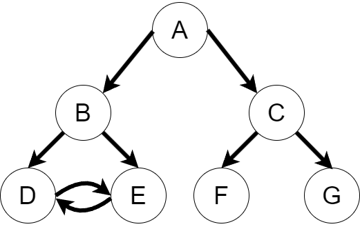
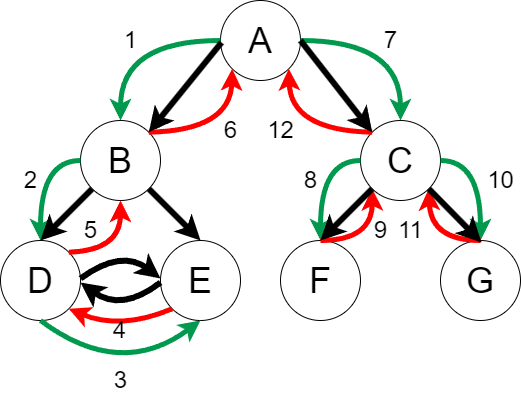
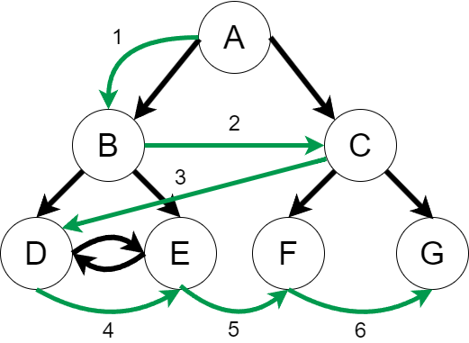

ข้อนี้ให้ค่าอุณหภูมิในตาราง $N \times N$ $(N \leq  20)$ และกำหนดว่าจากช่องใดๆ จะสามารถขยับไปช่องรอบๆ ที่มีอุณหภูมิที่สูงกว่าเท่านั้น โดยมีบางช่องที่ค่าอุณหภูมิเป็น 100 ซึ่งจะเข้าไม่ได้เลย

### แนวคิด

สำหรับข้อนี้เราสามารถมองว่าแต่ละช่องของเป็นตารางที่ไม่ได้มีค่าอุณหภูมิเป็น 100 เป็น Node และระหว่างสองช่องที่ติดกันจะมี Edge ที่มีทิศทางจากช่องที่มีอุณหภูมิน้อยกว่าไปยังช่องที่มีอุณหภูมิมากกว่า

จากนั้นหากทำ State Space Search เพื่อหาว่า Node ใดในตารางบ้างที่มี Path ที่เป็นไปได้จากช่องเริ่มต้นและเอาอันที่มีอุณหภูมิสูงสุดจะได้คำตอบที่ต้องการ

เช่นในตัวอย่างประกอบในโจทย์สามารถวาด Edge ได้ดังในรูป


### State Space Search

State Space Search (การค้นหาในปริภูมิสถานะ) เป็นรูปแบบขั้นตอนวิธีที่จะแทน State (สถานะ) เป็น Node ใน Graph โดย Node $A$ จะมี Edge ไปยัง Node $B$ ก็ต่อเมื่อสามารถเปลี่ยนจาก State $A$ ไป $B$ ได้ในหนึ่งขั้น ใน State Space Search เราจะเริ่มจาก Node ใดๆ แล้วพิจารณา Node รอบข้างที่มี Edge เชื่อมเพื่อพิจารณาแต่ละ State ที่สามารถไปถึงจาก State เริ่ม สำหรับข้อนี้จะต้องหา State ที่มีค่าอุณหภูมิสูงสุด

รูปประกอบต่อไปนี้เป็นตัวอย่างของ State Space 



ในตัวอย่างนี้จะเห็นได้ว่า State $B$ สามารถไป $D$ และ $D$ กับ $E$ สามารถไปมาซึ่งกันและกัน

ในการทำ State Space Search จะมีวิธีพื้นฐานหลักๆ สองแบบคือ Depth First Search (DFS) กับ Breadth First Search (BFS)

#### DFS

ใน DFS จะทำการค้นหาในรูปแบบ Recursive โดยสำหรับแต่ละ State ที่พิจารณา จะ DFS ลงไปใน Node ที่มี Edge ที่ยังได้ไม่ถูกพิจารณา

หากทำ DFS จาก State $A$ ในตัวอย่างก่อนหน้านี้จะได้ดังในรูป (ลูกศรสีเขียวแทนการเรียก DFS แบบ Recursive และลูกศรสีแดงแทนการ Return กลับมา)



ในตัวอย่างนี้จะพิจารณา State ในลำดับ $A,B,D,E,C,F,G$

เมื่อนำมาใช้กับข้อนี้จะได้โค้ดดังนี้

```cpp
int M;
int T[22][22];
int visited[22][22];

int dfs(int x, int y) {
  visited[x][y] = 1; // visited[x][y] จะแทนว่าช่อง x,y ถูกพิจารณาแล้ว

  int ret = T[x][y];

  int dx[4] = {0, 0, -1, 1};
  int dy[4] = {1, -1, 0, 0};
  for (int u = 0; u < 4; u++) { // พิจารณา 4 ทิศทาง
    int ux = x + dx[u];
    int uy = y + dy[u];

    if (1 <= ux && ux <= M && 1 <= uy && uy <= M && !visited[ux][uy] &&
        T[ux][uy] != 100 &&
        T[ux][uy] > T[x][y]) // ช่องใหม่ต้องอยู่ในกรอบ ยังไม่ถูกพิจารณา และ
                             // ต้องมีอุณหภูมิที่มากกว่าช่องปัจจุบันและไม่ใช่ 100
      ret = max(dfs(ux, uy), ret); // ค่าที่มากที่สุดจะเป็นค่าที่มากสุดของช่องนี้หรือช่องที่สามารถไปจากช่องนี้
  }

  return ret;
}
```

ในโค้ดตัวอย่างนี้จะพิจารณาแต่ละช่องที่อยู่ด้าน บน ล่าง ซ้าย หรือ ขวา ว่าเข้าเงื่อนไขที่จะสามารถไปจากช่องปัจจุบันไหมและหากสามารถไปจะเรียก DFS แบบ Recursive 

DFS จะใช้ Memory ใน Stack ตามความยาวของ Path ที่ทำ Recursion ซึ่งสำหรับข้อนี้เป็นได้อย่างมาก $\mathcal{O}(M^2)$ และจะใช้ Time Complexity ตามจำนวน Node และ Edge ที่ถูกพิจารณาซึ่งสำหรับข้อนี้เป็น $\mathcal{O}(M^2)$ เช่นกัน

#### BFS

สำหรับ BFS จะต่างจาก DFS ตรงที่เมื่อเจอ Edge ที่ไปได้แล้วจะไม่นำมาพิจารณาทันทีแต่ละนำเข้า Queue ก่อน โดยการพิจารณาแต่ละ Node จะเรียงตามลำดับใน Queue 

ตัวอย่างดังภาพ



ในตัวอย่างนี้จะพิจารณาเป็นลำดับ $A,B,C,D,E,F,G$ ตามลูกศรสีเขียว

โค้ด BFS ตัวอย่างสำหรับข้อนี้

```cpp
int M;
int T[22][22];

int bfs(int x, int y) {
  int queued[22][22];
  queued[x][y] = 1;
  std::deque<std::pair<int, int>> q; // Queue สำหรับการเก็บแต่ละ Node

  q.push_back(std::make_pair(x, y)); // นำ Node เริ่มต้นเข้า Queue

  int ret = T[x][y];

  while (!q.empty()) {
    int qx = q[0].first, qy = q[0].second;
    q.pop_front(); // นำ Node แรกมาพิจารณาและเอาออกจาก Queue

    ret = std::max(ret, T[qx][qy]);

    int dx[4] = {0, 0, -1, 1};
    int dy[4] = {1, -1, 0, 0};
    for (int u = 0; u < 4; u++) {
      int ux = qx + dx[u];
      int uy = qy + dy[u];

      if (1 <= ux && ux <= M && 1 <= uy && uy <= M && !queued[ux][uy] &&
          T[ux][uy] != 100 && T[ux][uy] > T[qx][qy]) {
        q.push_back(std::make_pair(ux, uy)); // ใส่ Node ใหม่ที่เจอเข้า Queue
        queued[ux][uy] = 1;
      }
    }
  }

  return ret;
}
```

สังเกตว่าในโค้ดนี้จะเรียก BFS เพียงรอบเดียวต่างจาก DFS โดยจะนำ Node มาใส่ Queue แทนการใช้ Recursion

BFS จะใช้ Memory ตามจำนวน Node ที่อยู่ใน Queue และเวลาตามจำนวน Node / Edge ที่ถูกพิจารณา

ดังนั้นทั้งคู่จะเป็น $\mathcal{O}(M^2)$ สำหรับข้อนี้
