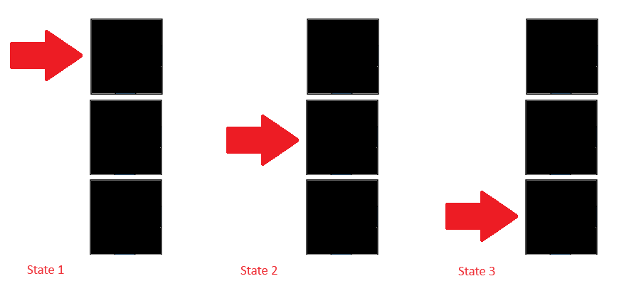
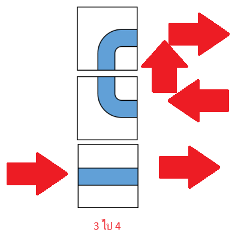
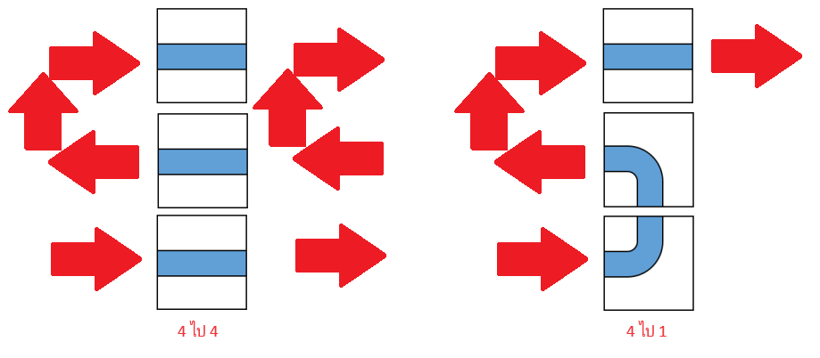

ข้อนี้ต้องการให้หาจำนวนวิธีที่จะสร้างตาราง $3 \times n$ $(n \leq 2^{30})$โดยวางท่อ 5 แบบดังในรูป เพื่อส่งน้ำจากด้านซ้ายไปยังด้านขวา โดยช่องที่มีทางออกจะต้องต่อกับช่องที่มีทางออกที่เชื่อมกันเท่านั้น

โดยมีเงื่อนไขว่า
1. ด้านซ้ายสุดมีทางออกด้านซ้าย 1 ทางพอดี
2. ด้านขวาสุดมีทางออกด้านขวา 1 ทางพอดี
3. ห้ามน้ำไหลออกด้านบนด้านล่างตาราง
4. ห้ามมีท่อที่ไม่มีน้ำไหลผ่าน

ข้อนี้เป็นโจทย์แนว Dynamic Programming โดยใช้ Matrix Exponentiation

### เคส $ n \leq 500000$

สำหรับเคสนี้สามารถใช้  Dynamic Programming  แบบธรรมดาโดยยังไม่ต้องใช้ Matrix Exponentiation

#### State 

ขั้นตอนแรกเราต้องพิจารณา State ที่เป็นไปได้เพื่อจะทำ Dynamic Programming

State ที่เห็นได้ง่ายที่สุดคือ State ที่น้ำเข้ามาของ row 1 2 และ 3 จากด้านซ้ายเป็น State 1 2 และ 3 ตามลำดับดังในภาพ

หากพิจารณากรณีที่มีทางออกด้านซ้ายสองทาง จะเห็นได้ว่าเป็นไปไม่ได้เพราะขัดจะขัดข้อ 1 (เพราะน้ำจะไหลย้อนไปแต่ไม่ย้อนกลับมา) จึงเห็นได้ว่า State ที่เหลือที่เป็นไปได้จะมีทางเข้า 3 ทั้ง 3 row สังเกตว่าในบรรดา State ที่มีน้ำเข้าจากด้านซ้ายทั้ง 3 row นี้ 2 จาก 3 row ที่เข้ามาจะต้องเชื่อมต่อกันอยู่แล้ว เพราะไม่งั้นจะทำให้ขัดกับข้อ 1 อีก (ถ้าไม่เชื่อมกันจะต้องออกด้านซ้ายซึ่งทำให้มีทางเข้าจากด้านซ้ายมากเกิน) เนื่องจากเส้นทางท่อไม่สามารถตัดกันจะได้ว่าทางที่เป็นไปได้คือ row 1 กับ 2 เชื่อมกันแล้ว หรือ row 2 กับ 3 เชื่อมกันแล้ว เราให้ State เหล่านี้เป็น State 4 และ 5 ตามลำดับ

#### Transition 

เมื่อเรารู้ State ครบแล้วต้องพิจารณา Transition ระหว่าง State สำหรับ Transition ระหว่าง State 1 2 และ 3 เห็นได้ง่ายจากช่องที่โจทย์ให้ คือ State 1 ไป State 1 หรือ 2 ได้ ส่วน 2 ไป 1 2 หรือ 3 ได้ และ 3 ไป 2 หรือ 3 ได้ ในภาพประกอบแสดงวิธีการ Transition จาก State 2 (ละ Transition ของ State 1 กับ 3 ไว้เพราะคล้ายคลึงกัน)

สำหรับ State 4 จะเห็นได้ว่าสามารถมาจาก State 3 ดังในภาพ เมื่อวางท่อเช่นนี้ด้าน row 1 กับ 2 จะเชื่อมกัน และมีทางออกด้านซ้ายทั้ง 3 row

เมื่ออยู่ใน State 4 แล้วสามารถอยู่ใน State 4 ต่อ (โดยใช้ท่อตรงต่อหมด) หรือเปลี่ยนไปเป็น State 1 โดยเชื่อม row 2 กับ 3 ดังในภาพ

ในทำนองเดียวกับ State 5 จะสามารถมาจาก State 1 และสามารถเปลี่ยนไปเป็น State 5 หรือ 3

สรุปคือมี Transition คือ $(1,1), (1,2), (1,5), (2,1), (2,2), (2,3), (3,2), (3,3), (3,4), (4,1), (4,4), (5,3), (5,5)$ 

#### การหาคำตอบ

กำหนดให้จำนวนวิธีที่มีด้านซ้ายเข้ามาเป็น State $s$ ใน column ที่ $i$ เป็น $dp[i][s]$ 

สังเกตว่าสำหรับ column แรกของตารางจะมีทางเริ่ม 3 State นี้คือน้ำต้องเข้ามาจาก row ที่ 1, 2 หรือ 3 (ตามเงื่อนไข 1) ดังนั้น $dp[1][1] = 1, dp[1][2] = 1, dp[1][3]=1, dp[1][4]=0,dp[1][5]=0$ 

จากนั้นเราสามารถคำนวณจำนวนวิธีที่จะได้แต่ละ State ในแต่ละ column $i$ สำหรับ $1<i< n$ ด้วย Dynamic Programming ตาม Transition ที่ระบุไว้ เนื่องจากมีเพียง 5 State และไม่เกิน $5^2$ Transition ดังนั้นจะใช้เวลา $\mathcal{O}(r^2)$ สำหรับแต่ละ $i$ เมื่อ $r$ คือจำนวน State

สำหรับ $i=n$ จะต้องคำนวณเพียง $dp[n][1], dp[n][2], dp[n][3]$ ด้วย Transition ดังกล่าว

ดังนั้นสำหรับทุก $i$ ใช้เวลาไม่เกิน $\mathcal{O}(r^2)$ เมื่อต้องทำ $n$ รอบจะใช้เวลา $\mathcal{O}(nr^2)$ ซึ่งเร็วพอสำหรับ $r=5, n=500000$

### เคส $n \leq 2^{30}$

สำหรับเคสนี้ต้องใช้ Matrix Exponentiation เพื่อให้ทันเวลา (สำหรับผู้ไม่คุ้นเคยกับ Matrix Exponentiation สามารถอ่านได้จาก https://programming.in.th/tasks/1134/solution)

สังเกตว่าสามารถเขียน Transition เป็น Matrix $A =\begin{bmatrix} 1 & 1 & 0 & 0 & 1 \\ 1 &  1 &  1 &  0 & 0 \\ 0 &  1 &  1 &  1 & 0 \\ 1 &  0 &  0 &  1 & 0 \\ 0 & 0 & 1 & 0 & 1 \end{bmatrix}  $ 

คำตอบที่ได้จาก Solution ในเคสก่อนหน้านี้จะเป็น  $\begin{bmatrix}\ 1 & 1  & 1 & 0 & 0 \end{bmatrix} A^{n} \begin{bmatrix}\ 1 \\\ 1 \\\ 1 \\\ 0 \\\ 0 \end{bmatrix} $ 

ดังนั้นหากเราใช้ Matrix Exponentiation คำนวณ $A^n$ ในเวลา $\mathcal{O}(r^3 \log n)$ จะหาทำให้คำตอบได้ในเวลา $\mathcal{O}(r^3 \log n)$ ซึ่งเพียงพอสำหรับข้อนี้
